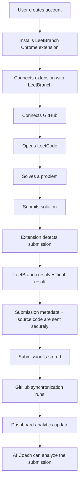
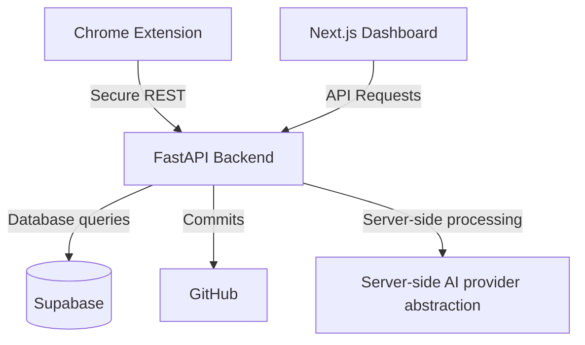

# LeetBranch

LeetBranch is a developer productivity platform that automatically captures LeetCode submissions, organizes solutions, synchronizes them with GitHub, and provides analytics and an AI-powered Developer Coach.

## Features

- Automatic LeetCode submission capture
- Accepted/rejected result detection
- Problem metadata
- Topic and difficulty classification
- POTD support
- Weekly contest support
- Biweekly contest support
- GitHub synchronization
- Duplicate submission handling
- Submission history
- Developer analytics
- Activity heatmap
- Topic strengths/weaknesses
- Difficulty analytics
- Language analytics
- Contest analytics
- AI Developer Coach
- AI analysis caching
- Free/Premium AI quotas
- Manual Premium membership workflow
- Admin console
- Usage monitoring
- Secure authentication
- Row Level Security

## How LeetBranch Works



When you solve and submit a problem on LeetCode normally, the browser extension detects the submission. LeetBranch determines the final result (e.g., Accepted). The metadata and source code are securely transmitted to the backend, stored in the database, and automatically synchronized to your configured GitHub repository. Your dashboard analytics update immediately, and the AI Developer Coach becomes available to analyze your solution.

## How to Use LeetBranch

### Step 1 — Create an account
Navigate to the LeetBranch application and register or sign in using your email address. Follow the verification steps if necessary.

### Step 2 — Install the Chrome extension
To install the extension locally:
1. Build the extension using `npm run build` in the `apps/extension` directory.
2. Open Chrome and navigate to `chrome://extensions`.
3. Enable **Developer Mode** in the top right corner.
4. Click **Load unpacked** and select the built extension directory (`apps/extension/dist`).
5. *Note: Remember to reload the extension here whenever you rebuild it.*

### Step 3 — Connect the extension
1. Open the LeetBranch dashboard and navigate to **Integrations**.
2. Under the Chrome Extension section, click **Generate Pairing Code**.
3. Open the installed LeetBranch Chrome extension popup and enter the pairing code.
4. The extension is now securely connected to your account.

### Step 4 — Connect GitHub
1. In the **Integrations** page of the LeetBranch dashboard, click **Connect GitHub**.
2. Follow the authorization flow to install the GitHub App.
3. Once authorized, return to the Integrations page and select a repository from the dropdown menu to sync your solutions to.

### Step 5 — Solve normally on LeetCode
You do not need to manually upload any solutions. Simply use LeetCode as you normally would. When you submit a problem, LeetBranch handles the rest automatically in the background.

### Step 6 — Understand submission states
LeetBranch tracks the final outcome of your submissions. Temporary LeetCode judging states (Pending, Judging) are handled internally until a final state is reached. Supported states include:
- Accepted
- Rejected
- Compile Error
- Runtime Error
- Wrong Answer

*Note: Running code ("Run Code") is not treated as a final submission and is not captured.*

### Step 7 — View analytics
Your LeetBranch dashboard provides comprehensive analytics on your performance, including:
- Total solved and Acceptance rate
- Current Streak and Activity heatmap
- Difficulty and Languages breakdown
- Topics and Weakness analysis
- Contest performance
- Recent submissions history

### Step 8 — Use AI Developer Coach
1. Open any accepted submission from your dashboard.
2. Navigate to the **AI Coach** tab.
3. Request an analysis to review time/space complexity, common mistakes, and hints.
4. Chat with the coach for further questions or optimizations.
5. Use "Analyze Again" if you need a fresh analysis.

## AI Cache Behavior

Identical analysis requests may use a recent server-side cached analysis for a limited period. This behavior:
- Reduces unnecessary AI requests.
- Improves response time.
- Preserves your AI quota.

If you modify your code or need a completely fresh perspective, use the "Analyze Again" option to bypass the cache.

## Free vs Premium

LeetBranch offers two tiers for the AI Developer Coach:

### Free
- Free AI access
- Limited monthly/daily usage according to the system configuration
- Standard AI experience

### Premium
- Premium AI access
- 500 AI analyses per month
- 1000 AI chat messages per month
- Premium membership status
- Higher AI usage allowance

*Note: The AI Provider and model selection are handled entirely server-side. Pricing is controlled by the administrator and displayed dynamically within the application.*

## Premium Purchase Workflow

To upgrade to Premium:
1. Open **Premium Membership** in the LeetBranch dashboard.
2. View the current Premium price and the configured UPI information (or QR code).
3. Complete the payment using your preferred UPI application.
4. Enter the transaction/reference ID into the payment request form.
5. Submit the payment request.
6. Wait for administrator verification. Once approved, Premium becomes active immediately.
7. If rejected, you can review the status and submit again according to the application's rules.

## Premium Expiration

When your Premium membership expires:
- Premium access ends, and you return to the Free plan.
- The AI provider/model selection gracefully falls back to the Free tier configuration handled server-side.
- Free quotas apply again.
- All your existing data, analyses, and synchronized solutions remain fully available.

## Admin Console

Administrators have access to a secure server-side console to manage:
- Dashboard metrics and AI usage
- Users and Subscriptions
- Payments and UPI configuration
- Premium pricing
- Audit logs

*Administrative access is protected strictly server-side.*

## Troubleshooting

### Extension not detecting submissions
Check the following:
- The extension is loaded and active.
- Correct permissions are granted in Chrome.
- LeetCode is open on a supported problem page.
- The extension is connected (verify status in the popup).
- The extension has been reloaded after any local rebuild.

### GitHub sync not happening
Check the following:
- Your GitHub connection status in the Integrations page.
- The repository configuration is correctly saved.
- The Sync status in your dashboard.
- GitHub authorization is still valid.

### AI Coach unavailable
Check the following:
- Your login session is active.
- You have remaining AI usage quota.
- Your Premium status (if applicable).
- Backend availability (if self-hosting).
- Environment configuration (if self-hosting).

### Premium payment pending
Manual payments require administrator verification. Please wait for an admin to review and approve your transaction ID.

## Self-Hosting Guide

### Requirements
- Node.js (v18+)
- Python (v3.10+)
- PostgreSQL (via Supabase)
- Git
- Chrome/Chromium for extension development

### 1. Clone the repository
```bash
git clone https://github.com/Soubhik-07-ops/LeetBranch.git
cd LeetBranch
```

### 2. Install dependencies
Backend:
```bash
cd apps/api
python -m venv venv
source venv/bin/activate  # On Windows: venv\Scripts\activate
pip install -r requirements.txt
```

Frontend:
```bash
cd apps/web
npm install
```

Extension:
```bash
cd apps/extension
npm install
```

### 3. Environment Variables

Create `.env` files in both the API and Web directories based on the provided `.env.example` files.

**Backend (`apps/api/.env`)**:
- `SUPABASE_URL`: Your Supabase project URL.
- `SUPABASE_KEY`: Your Supabase service key (Keep this strictly on the backend).
- `JWT_SECRET`: Secret used for signing JWTs.
- `GITHUB_CLIENT_ID`: Your GitHub App client ID.
- `GITHUB_CLIENT_SECRET`: Your GitHub App client secret (Backend only).
- `GITHUB_PRIVATE_KEY`: Your GitHub App private key (Backend only).
- `WEB_URL`: The URL of your frontend dashboard.
- AI Provider API Keys: Server-side API keys required for Free and Premium AI provider configurations. Do not expose these to the frontend.

**Frontend (`apps/web/.env`)**:
- `NEXT_PUBLIC_SUPABASE_URL`: Your Supabase project URL.
- `NEXT_PUBLIC_SUPABASE_ANON_KEY`: Your Supabase anonymous key.
- `NEXT_PUBLIC_API_URL`: The URL of your backend API.

*Note: Secrets such as Database passwords, GitHub private keys, and AI API keys belong ONLY on the backend.*

### 4. Database Setup (Supabase)
Run the SQL migrations located in `apps/api/app/integrations/supabase/` against your PostgreSQL database.
Migrations must be applied in the intended order:
- `002_schema.sql`
- `004_...`
- `005_...`
- `006_...`
- `007_...`
- `008_...`
- `009_...`
- `010_...`
- `011_...`
- `012_manual_payments.sql`
- `013_admin_views.sql`
- `014_admin_usage.sql`
- `015_premium_limits_and_cache.sql`

Row Level Security (RLS) is an integral part of the security model and is enforced by these migrations.

### 5. Chrome Extension Development
The extension source code is located in `apps/extension`.
- To build the extension: `npm run build`
- To connect it to your local backend, update the API URL in the extension configuration.
- Load the unpacked extension from `apps/extension/dist` via `chrome://extensions`.
- Submission capture works by detecting the LeetCode API responses and DOM state.
- Synchronization is triggered via secure authenticated requests to the backend API.

## Architecture


- **Chrome Extension**: Detects submissions on LeetCode.
- **FastAPI Backend**: The central orchestrator handling authentication, integrations, AI analysis routing, and synchronization.
- **Supabase**: Relational database handling users, submissions, streaks, analytics, and RLS.
- **GitHub Integration**: Synchronizes verified solutions to the user's repository.
- **Next.js Dashboard**: The public-facing interface for viewing progress and analytics.

## Security

LeetBranch employs robust security practices:
- **JWT Authentication**: Secure token-based access.
- **Server-Side Identity Resolution**: Prevents IDOR (Insecure Direct Object Reference).
- **Supabase RLS**: Database-level Row Level Security limits access strictly to the data owner.
- **Admin Authorization**: Administrative actions are protected by strict server-side role checks.
- **Server-Side AI Provider Selection**: Prevents clients from forcing specific AI models or manipulating routing.
- **Server-Side Quota Enforcement**: API rate limiting and AI quotas are enforced centrally.
- **Input & Output Validation**: All external inputs and AI outputs are strictly validated.
- **No Client-Side API Keys**: AI keys, GitHub keys, and database credentials exist only on the backend.
- **Audit Logs**: Administrative actions and payment changes are logged.
- **Cache Isolation**: The AI analysis cache is strictly scoped and isolated.

## Contributing

1. Fork the repository
2. Create a feature branch: `git checkout -b feature/my-feature`
3. Make your changes
4. Run backend tests: `cd apps/api && pytest -v`
5. Run frontend tests: `cd apps/web && npm run build` (typecheck)
6. Run extension tests: `cd apps/extension && npm run build && npm test`
7. Check git diff for whitespace/formatting issues
8. Submit a pull request

## License

Copyright (c) 2026 Soubhik Roy

Project: LeetBranch
GitHub: [https://github.com/Soubhik-07-ops/LeetBranch](https://github.com/Soubhik-07-ops/LeetBranch)
