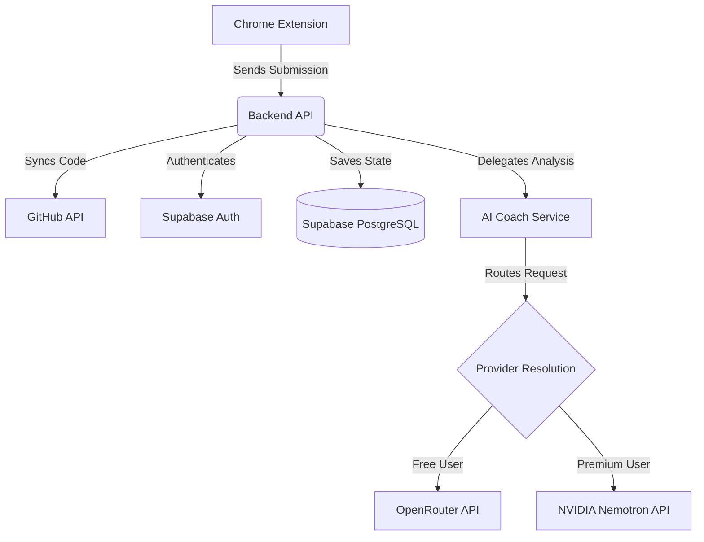

# LeetBranch

LeetBranch is an open-source, AI-powered platform that automatically synchronizes your accepted LeetCode solutions to a GitHub repository, enriching them with AI-generated analysis, complexity metrics, and personalized coaching.

The platform consists of a Chrome extension that detects your LeetCode submissions in real-time, a Python backend that processes and synchronizes the code, and a Next.js dashboard that visualizes your coding progress and provides an interactive AI Developer Coach.

## Features

- **LeetCode Integration**: Automatically detects and captures accepted LeetCode submissions.
- **GitHub Synchronization**: Pushes your solutions to a structured GitHub repository with an AI-generated Markdown README.
- **Analytics Dashboard**: Tracks your coding activity, streaks, topic proficiency, and difficulty distribution.
- **AI Developer Coach**: Provides structured feedback on your code's time/space complexity, readability, and potential edge cases.
- **AI Chat**: An interactive chat interface to discuss your specific code submission and explore alternative approaches.
- **Premium Quotas & Limits**: Built-in support for free and premium tiers, metering AI analysis and chat quotas securely on the server.
- **AI Caching**: Submissions that have already been analyzed are cached for 15 minutes to prevent redundant API calls and save quota.
- **Analyze Again**: Allows you to explicitly bypass the cache and regenerate the analysis using the latest model.
- **Admin Console**: A dedicated view to monitor system usage, approve manual premium payments, and manage user subscriptions.

## Architecture

The system is built on a scalable, modern technology stack, divided into the following layers:



### Provider Resolution
Provider selection is securely enforced on the server-side to prevent client manipulation:
- **FREE users**: Routed to OpenRouter (using efficient, capable open models).
- **PREMIUM users**: Routed to NVIDIA Nemotron APIs for state-of-the-art reasoning and performance.
- **Expired Premium**: Automatically gracefully falls back to the Free tier (OpenRouter).

## AI Quotas & Limits

Server-side limits are rigorously enforced to prevent abuse:
- **FREE Tier**: 5 Analyses / Day, 10 Chats / Day
- **PREMIUM Tier**: 50 Analyses / Month, 300 Chats / Month

## AI Caching

To optimize API usage and provide a snappy user experience:
- A `15-minute` cache TTL is enforced for AI requests.
- The input is hashed deterministically based on the user ID, submission code, problem ID, programming language, model, and prompt version.
- **Cache hits do NOT consume user quotas**.
- Users can trigger a fresh analysis by clicking "Analyze Again", bypassing the cache but consuming quota.

## Security Architecture

- **Environment Variables**: No secrets or API keys are exposed to the frontend or extension.
- **Authentication**: JWT-based authentication via Supabase Auth.
- **Authorization & RLS**: All API endpoints and database tables are protected. Supabase Row Level Security (RLS) ensures users can only access their own submissions, analytics, and AI histories.
- **Admin Guards**: Administrative operations are locked behind backend validation of the `admin` role.
- **IDOR Protections**: The API explicitly filters all queries (like `GET /submissions/{id}`) by the authenticated `user_id`.

## Technology Stack

### Frontend
- Next.js (App Router)
- React
- CSS Modules
- Recharts (for Analytics)

### Backend
- Python 3
- FastAPI
- HTTPX (Async Network Requests)

### Database
- Supabase (PostgreSQL)

### Extension
- Chrome Extension (Manifest V3)
- TypeScript
- ESBuild

## Prerequisites

Before setting up the project, ensure you have the following installed:
- Node.js (v18 or higher)
- npm
- Python (v3.10 or higher)
- A Supabase account and project
- GitHub App credentials
- OpenRouter API Key (for Free tier)
- NVIDIA API Key (for Premium tier)

## Installation

### 1. Clone the repository
```bash
git clone https://github.com/yourusername/LeetBranch.git
cd LeetBranch
```

### 2. Backend Setup
```bash
cd apps/api
python -m venv venv

# Activate the virtual environment
# Windows:
venv\Scripts\activate
# macOS/Linux:
source venv/bin/activate

pip install -r requirements.txt
```

### 3. Frontend Setup
```bash
cd ../web
npm install
```

### 4. Extension Setup
```bash
cd ../extension
npm install
npm run build
```

## Environment Variables

You must supply the following environment variables in `apps/api/.env` and `apps/web/.env.local`.

### `apps/api/.env`
| Variable | Required | Description | Where Used |
|----------|----------|-------------|------------|
| `FRONTEND_URL` | Yes | The URL of the Next.js web application (e.g., `http://localhost:3000`) | CORS & OAuth redirects |
| `CORS_ORIGINS` | Yes | Comma-separated list of allowed origins | FastAPI CORS |
| `SUPABASE_URL` | Yes | Your Supabase project URL | Database operations |
| `SUPABASE_SERVICE_ROLE_KEY` | Yes | Your Supabase Service Role Key | Bypassing RLS for admin operations |
| `GITHUB_APP_ID` | Yes | The ID of your GitHub App | GitHub Sync |
| `GITHUB_APP_CLIENT_ID` | Yes | Client ID of your GitHub App | GitHub Sync |
| `GITHUB_APP_CLIENT_SECRET`| Yes | Client Secret of your GitHub App | GitHub Sync |
| `GITHUB_APP_PRIVATE_KEY` | Yes | The private key content for your GitHub App | GitHub Sync authentication |
| `GITHUB_APP_SLUG` | Yes | The slug of your GitHub app (e.g., `leetbranch-app`) | GitHub Installation links |
| `OPENROUTER_API_KEY` | Yes | Your OpenRouter API key | Free tier AI |
| `OPENROUTER_BASE_URL` | Yes | OpenRouter endpoint (`https://openrouter.ai/api/v1`) | Free tier AI |
| `OPENROUTER_FREE_MODEL` | Yes | OpenRouter model string (e.g., `meta-llama/llama-3.1-8b-instruct`) | Free tier AI |
| `NVIDIA_API_KEY` | Yes | Your NVIDIA API key | Premium tier AI |
| `NVIDIA_BASE_URL` | Yes | NVIDIA endpoint (`https://integrate.api.nvidia.com/v1`) | Premium tier AI |
| `NVIDIA_MODEL` | Yes | NVIDIA model string (e.g., `nvidia/nemotron-4-340b-instruct`) | Premium tier AI |

### `apps/web/.env.local`
| Variable | Required | Description | Where Used |
|----------|----------|-------------|------------|
| `NEXT_PUBLIC_SUPABASE_URL` | Yes | Your Supabase project URL | Supabase Auth (Frontend) |
| `NEXT_PUBLIC_SUPABASE_ANON_KEY` | Yes | Your Supabase Anon Key | Supabase Auth (Frontend) |
| `NEXT_PUBLIC_API_URL` | Yes | Backend API URL (e.g., `http://localhost:8000/api/v1`) | API fetching |

## Supabase Setup
1. Create a new project on [Supabase](https://supabase.com/).
2. Copy the Project URL, Anon Key, and Service Role Key.
3. Link your Supabase project locally using the Supabase CLI, or execute the SQL files in `apps/api/app/integrations/supabase/` sequentially (starting from `schema.sql` and then `002_*.sql`, etc.) in the Supabase SQL Editor.
4. The migrations will automatically create all tables, apply Row Level Security (RLS) policies, insert seed data (such as billing plans), and define secure RPCs for atomic operations.

## AI Provider Setup
- **OpenRouter**: Visit [OpenRouter](https://openrouter.ai/) to generate an API key.
- **NVIDIA**: Visit the [NVIDIA API Catalog](https://build.nvidia.com/) to generate an API key.

## GitHub Integration
1. Go to your GitHub Developer Settings and create a new **GitHub App**.
2. Give it permissions to read/write `Contents` and read `Metadata`.
3. Generate a Private Key (`.pem`) and copy the App ID, Client ID, and Client Secret into your `apps/api/.env`.
4. Ensure the `.pem` file is not tracked by Git, or directly supply its contents into the `GITHUB_APP_PRIVATE_KEY` environment variable.

## Chrome Extension Installation
1. After running `npm run build` in `apps/extension`, the output will be generated in `apps/extension/dist`.
2. Open Chrome and go to `chrome://extensions/`.
3. Enable **Developer Mode** in the top right.
4. Click **Load unpacked** and select the `apps/extension/` folder.
5. Log into the LeetBranch Web Dashboard, copy the pairing code from the Integrations tab, and paste it into the Chrome Extension popup to link it securely.

## Running Locally

### Backend
```bash
cd apps/api
# Ensure your virtual environment is active
uvicorn app.main:app --reload --port 8000
```

### Frontend
```bash
cd apps/web
npm run dev
```

## Testing

### Backend
```bash
cd apps/api
pytest -v
```

### Frontend
```bash
cd apps/web
npx tsc --noEmit
npm run build
```

## Production Build

To build the frontend for production deployment:
```bash
cd apps/web
npm run build
npm start
```
The FastAPI backend can be run using a production ASGI server like Gunicorn or Uvicorn workers.

## Security Guidelines

- **Never** commit `.env`, `.env.local`, `.env.production` files.
- **Never** commit `.pem`, `.key`, or any private credential files.
- **Never** expose `SUPABASE_SERVICE_ROLE_KEY` to the frontend or extension.
- **Rotate** any compromised credentials immediately.
- Use `environment variables` exclusively for secret management.

## Contributing

1. Fork the repository
2. Create a feature branch (`git checkout -b feature/amazing-feature`)
3. Make your changes and run the tests (`pytest -v` and `npx tsc --noEmit`)
4. Commit your changes (`git commit -m 'feat: add amazing feature'`)
5. Push to the branch (`git push origin feature/amazing-feature`)
6. Open a Pull Request

## License

This project is licensed under the MIT License - see the [LICENSE](LICENSE) file for details.

## Author

**Soubhik Roy**

## Project Status

**Production Ready**
LeetBranch is fully stable, tested, and actively maintained as an open-source tool.
